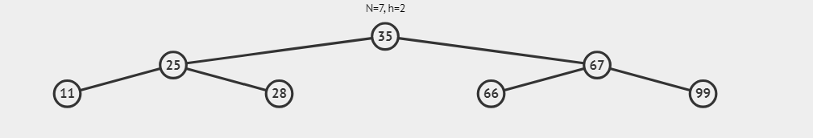

# BST Workshop

## Binary Search Tree (BST)

A binary search tree (BST) is a data structure that organizes data hierarchically, allowing for efficient insertion, deletion, and lookup operations. In a BST, each node contains a value, and it follows two key properties:

- The value of every node in the left subtree is less than the value of the node itself.
- The value of every node in the right subtree is greater than the value of the node itself.

These properties ensure that search operations can be performed in O(log n) time on average, making BSTs an efficient choice for storing and retrieving ordered data. **The implementation is compatible with the Java Collections API**.

## Method Descriptions

The following methods are implemented in the BinaryTree class:

- **insert(int key)**: Adds a new node with the specified key to the BST. It maintains the properties of the BST during insertion.

- **delete(int key)**: Removes a node with the specified key from the BST while maintaining its structure and properties. Handles three cases:
    - The node to be deleted is a leaf node (no children).
    - The node has only one child.
    - The node has two children.

- **search(int key)**: Searches for a node with the specified key in the BST. Returns the node if found, otherwise returns null.

- **inorderTraversal()**: Performs an inorder traversal of the BST, printing the keys in ascending order.

- **preorderTraversal()**: Performs a preorder traversal of the BST, printing the keys in the order of root, left, right.

- **postorderTraversal()**: Performs a postorder traversal of the BST, printing the keys in the order of left, right, root.

- **findMin()**: Finds and returns the node with the minimum key in the BST.

- **findMax()**: Finds and returns the node with the maximum key in the BST.

- **height()**: Calculates and returns the height of the BST.

- **isBalanced()**: Checks if the BST is balanced by verifying that the height difference between the left and right subtrees is no more than one for every node.

- **levelorderTraversal()**: Performs a level-order traversal of the BST, printing the keys from top to bottom and left to right.

- **countNodes()**: Returns the total number of nodes present in the BST.

- **clear()**: Removes all nodes from the BST, effectively making it empty.

## Test Code

The BST code includes a short test of the implemented methods, allowing you to see the operations in action. The following image presents the Binary Search Tree implemented for the example.



## Downloading and Running the Code

To download and execute the BST code, follow these steps:

1. **Clone the Repository**: Use Git to clone the repository to your local machine.
   ```bash
   git clone https://github.com/SebSanUwU/TallerBST
   cd TallerBST
   javac BinaryTree.java BST.java
   java BST

